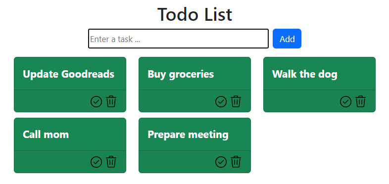
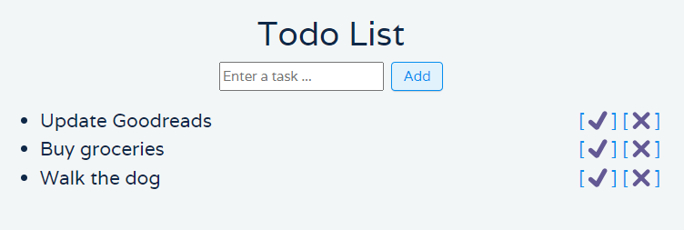

# MyTodoApp

A todo app made with Python, Flask and Bootstrap.

## Goal

- Have my own todo app with complete control over my data.
- Learn me some Flask
- Create my first Python web app

## App

- I use Visual Studio Code.
- Created a virtual environment for Python (Python 3.11.2)
- I am using Windows 11. Haven't tested the code on MacOS or Linux.
- You will need to install the following Python modules: Flask and Flask-SQLAlchemy

```shell
pip install flask
pip install flask-sqlalchemy
```

### `app.py`

Still based on the code from Alina Chudnova, see version 0.1.0.

### `importer.py`

This is some code that I reuse for many projects. The two functions create a connection to a SQLite database and specify the log-file and file mode (write or append).

It then reads the contents of the `new_todo.csv` file (current directory). Each line in the file represents a new to do. The script stops reading when it has reached the end of the file or an empty line. This means you can store tasks for the following days in this file. You just have to separate it with an empty line from the tasks you want to import in the database.

## History

### Version 0.1.5

**Date**: 26/11/2023

- Correcting documentation
- Adding database schema FYI

```sql
CREATE TABLE todo_item (
        id INTEGER NOT NULL, 
        content VARCHAR(200), 
        completed BOOLEAN, 
        PRIMARY KEY (id)
);
```

### Version 0.1.4

**Date**: 25/11/2023

- Completed cards are now moved to the end of the list.
 
### Version 0.1.3

**Date**: 25/11/2023

- Completion of a card / to do can now be checked and unchecked.

### Version 0.1.2

**Date**: 17/10/2023

- Removed some unnecessary HTML code
- Added `importer.py`, a script to easily pump some tasks into the database

### Version 0.1.1

**Date**: 09/10/2023

- No changes to the Python code
- Switched from using Bootstrap 4 (used in YouTube tutorial) to Bootstrap 5
- Tasks are now shown as Bootstrap cards instead of a simple list.




### Version 0.1.0

**Date**: 08/10/2023

As it is my first time working with Flask, this version is completely based on the YouTube video [Building a Todo List App: Introduction to Flask](https://www.youtube.com/watch?v=-mH_VpW1Bko) by Alina Chudnova.



